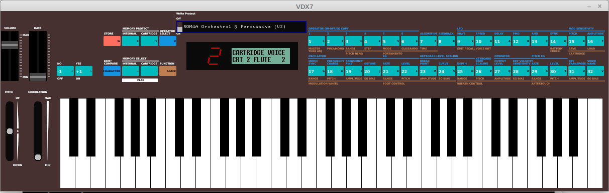

# VDX7 - Bit-accurate DX7 synthesizer emulation

## Intro

This is a highly accurate emulation of the Yamaha DX7 Mark I FM synthesizer
designed for GNU/Linux.  The ultimate goal is a "bit-accurate" emulation, at
least insofar as specifications available publicly. It is built upon the work
of a host of people including ajxs @ajxs (ROM disassembly), Ken Shirriff @shirriff (OPS chip
analysis), Raph Levian @raphlinus (MSFA), Pascal Gauthier @asb2m10 (Dexed) and many others past and
present that have contributed to the understanding of this iconic synthesizer.

The synth is designed to run on Linux, with a simple X11-based GUI, and Jack
for audio and MIDI transport.



## Build

See [INSTALL.md](INSTALL.md).

## Usage

The best way to learn the synth's features is to refer to the original
Operation Manual, readily available online.

Running the app with no command line options will autoconnect to any available
MIDI inputs and connect the synth output to the system audio ports. A Jack
server needs to be running, though some distros will automatically start a
jackd instance with the last used parameters.

The GUI includes a "toy" keyboard that can be used for testing and auditing
voices, along with mod and pitchbend wheels (the LV2 plugin version does not
include these). Keyboard keys are mapped to notes, shift shifts an octave, and
the spacebar is a sustain pedal. The vertical position of mouse clicks on the
keys maps to velocity.

The \<Ctrl> key has a special function to allow multiple buttons to be held
simultaneously, as described later. The \<Esc> key exits the app (the app can
also be exited by clicking the window manager's "x" button).

Left clicking on the Cartridge slot pops up a file chooser that allows you to
load a cartridge file (in SYSEX format). Single click selects files or opens
directories, clicking ".." goes up one level, double click or \<Enter> loads the
selected file, the arrow keys move the selection, etc.  The <\*> key toggles a
filter that either shows all files, or just those with a ".syx" extension.
While in the file chooser, pressing the \<f> key toggles to a menu of the 8
original factory ROM cartridge banks, which are built into the app. 

### Command Line Options
The command line -h option returns:
```
Usage: dx7 
   -h (this help)
   -v (version)
   -q quiet (no terminal stdout)
   -a don't autoconnect Jack midi
   -m send MIDI directly to DX7 serial interface
   -k don't show keyboard on GUI
   -c filename (sysex cartridge file)
   -n filename (create new sysex cartridge file)
   -r filename (load a firmware ROM)
   -b [0-7] (bank number: load factory voice cartridge into internal memory)
   -B [0-7] (bank number: load factory voice cartridge into cartridge memory)
   -s filename (save/restore RAM memory file, default ~/.config/dx7/dx7.ram)
   -t master tuning (+/-256 steps, ~.3 cents/step, default 0=A440)
   -V MIDI velocity curve (.25 to 4.0, default 0.4, 1.0=linear)
   -p port (jack audio port)
   -i midi-in (jack midi in port regex)
   -o midi-out (jack midi out port regex)
```

The synth will try to autoconnect to all Jack audio sink ports. The "-p"
option allow you to specify a specific port or ports (using a regex).

The synth will also try to autoconnect Jack MIDI ports (the "-a" option
prevents this).  The "-i" and "-o" options allow you to specify which MIDI
ports to connect to for input and output respectively. Jack allows these to be
regular expressions (though the exact regex syntax is evidently not
documented).  This is useful to prevent MIDI "boomerang" loops, since the
synth will output MIDI from the GUI keyboard, and receive the same note if the
system in and out ports are connected. Use something like -i
"midi_capture_[^1]$", for example, if midi_capture_1 is the system port. Note
that the synth does not re-transmit MIDI received, so you only get the
boomerang on notes played from the internal GUI keyboard, not an external MIDI
keyboard that you would use for normal performance.

With no option, the synth will try to read a file in the user's home directory
"~/.config/dx7/dx7.ram", which contains the persistent state of the synth's
RAM. If this file is not found, you will see a "Change Battery" message on the
LCD at startup, because the DX7 thinks the battery backup has failed (the real
synth has a battery backup RAM).  The RAM will be initialized to a default set
of voices, the factory "ROM3A" cartridge (which the real synth does not
actually do, you would have to load voices into internal memory from a
cartridge if there was a dead battery).  After the first invocation, it will
save the config file and the battery message will disappear.

The "-s" option allow you to use a different RAM image file, rather than the
one saved in .config. 

The "-r" option allows you to load an alternative firmware ROM into the synth.
The default is the "1.8" version which was the final factory version, but
there is also a "Special Edition" ROM available that adds some potentially
useful features. 

You can change the default initial patch bank with the "-b" option followed by
a number from 0 to 7 corresponding to the respective factory ROM cartridge (1A
through 4B). The internal RAM will retain whatever voices were loaded into it
- you can load a cartridge, or edit voices, as per the Operation Manual.  The
-B option (capital B) will load the given factory ROM into the cartridge
memory.

The "-c" option allows you to specify a cartridge to be loaded into the
cartridge slot of the synth. Cartridge files are expected to be in MIDI SYSEX
format (4104 bytes), which is the typical way voice cartridges are exchanged.
The "-n" option creates a new cartridge blank file, but it will not be saved
unless you go through the DX7's cartridge save procedure. That entails
switching the cartridge's write protect switch "off" on the GUI (as you would
on a R/W cartridge), then switching the firmware's cartridge write protect
"off" (the green "Y" button on the top left), then Function 15 to save the
voices to cartridge (answering "yes" twice).  You can copy the cartridge
voices to internal memory following a similar procedure.

In general all functions of the synth operate as described in the Operation
Manual. Initially, you will probably want to turn on some useful functions,
which are disabled by default in the original DX7. In particular, you may want
to set the Modulation Wheel Range, and turn on Pitch, Amplitude, or EG Bias as
desired. You will also probably want to set the Pitch Bend range.
Portamento/Glissando can be turned on when needed, and set Poly/Mono mode (it
defaults to Poly). All of these selections are saved in the persistent RAM
file.

The "-t" option allows you to specify the master tuning, rather than using the
firmware's tuning function.  In the 1.8 firmware, the DX7 doesn't indicate the
tuning, so if you move the slider you won't get back to A440 except "by ear"
(but we're all musicians, right?).  In the Special Edition firmware, the
tuning pitch is displayed on the LCD.

Note that a few functions, notably editing voice names and saving voices,
require you to hold down a button while pressing another. In order to do this
with a mouse, press and hold the "Ctrl" key, then click a button, which will
stay down and be released only when you release the Ctrl key. You can then
click other buttons with the initial button held.  You need do this to edit a
voice name by holding down the "CHARACTER" button will clicking the
alphabetical buttons.  You also hold down the "STORE" button to save a voice.
Refer to the Operation Manual for the full procedures. You can only hold one
key, though, so invoking the "hidden" firmware "Test" function mode by holding
Function, #16, and #32 is not possible through the GUI (nor is it necessary).
In addition to the "hold" function, the Ctrl key enables a fine adjust
capability when moving a slider with the mouse wheel, which can sometimes be
helpful.

### MIDI

The synth will send and receive MIDI. The DX7's MIDI protocol is documented in
the Owner's Manual.  The "-m" option will send all MIDI directly to the synth,
as in the hardware.

Otherwise, MIDI is filtered to add a few features prior to handing off to the firmware. 

- The "-V" option enables a MIDI velocity curve, which can be used to
  better match your MIDI keyboard to the DX7's expectation of velocity
  (see below).
- Controller 11 (Expression Pedal) can be used as a smoother volume
  control (with the full 128 levels - the native DX7 MIDI volume control
  on Controller 7 has just 8 levels). The two are additive, which can be a bit
  counter-intuitive, since if one is set to the max, the other won't do
  anything.  So if you want the smoother control, set CC7 to 0 and send on CC11
  (or vice versa if for some reason you want the original 8 levels). If you want
  a swell pedal effect, set CC7 to some intermediate value (say 64 for 50%
  volume), then CC11 will swell from 50% to 100% volume.

The synth also sends and receives SYSEX messages to change parameters and load
voices, as documented in the Manual.


A note about MIDI velocities... every keyboard responds differently,  and most
MIDI controllers offer a variety of velocity curves to suit the player's
touch. The velocity response of the DX7's hardware keyboard (i.e. mapping of
the actual key velocity to the internal digital velocity value, which is
nominally 127 steps) is to my knowledge not known, so how your controller
responds to touch is going to be a factor in how some voices sound. By default
the synth applies a MIDI velocity curve with a parameter you can specify (1.0
is linear, 0.4 is concave and the default value). You may need to adjust the
curve to suit playing style or the response of specific patches (which can be
quite uneven). You can optionally send MIDI data directly through the "serial"
interface ("-m" option) as would happen if you connected your keyboard to a
hardware DX7 (subject to the limitations described below).

A note about performance...  This synth is somewhat of a CPU hog.  You will
likely need a fairly powerful multi-core processor to avoid xruns. It's the
nature of the beast - to precisely emulate the hardware it uses your CPU's
integer ALU rather than the more pipelined floating point ALU, and computes
all 96 operator samples on each cycle. It then resamples from the native 49khz
sample rate to the proper system audio rate. There are certainly more
efficient ways of doing FM synthesis, but this particular project is intended
to have as much fidelity to the original hardware as possible. See the
README.code for details.

### BUGS
MIDI bugs in the V1.8 ROM:

- Control Change CC0 triggers a reset of the CPU (it runs off the end of a
  jump table and hits an illegal instruction, resulting in a trap). The reset
  clears some of the Function settings. Note that when not in direct MIDI "-m"
  mode, the synth intercepts and filters these out to avoid the bug.

- The DX7's MIDI implementation quantizes MIDI velocity to 32 steps (on both
  send and receive), with limits on the maximum and minimum values. In
  addition, the velocity curve used for MIDI input is _different_ than the
  curve for output - so if you play a performance on a DX7 keyboard and record
  the MIDI, then play back the MIDI sequence through the synth, you get a
  slightly different performance. Why they designed it that way - especially
  given the limited memory available, is a mystery to me.

- Control Change CC126 (turns on Mono mode) must send parameter value "1" to
  work, but CC127 (turns on Mono mode) ignores the value byte.

- In the firmware, MIDI CC123 (all notes off) fails to clear some stuck notes.
  Stuck notes also reduce the number of available voices until cleared by
  setting synth to Mono and back to Poly. Changing to another voice stops the
  stuck notes, but does not clear the note buffer. As a workaround, the synth
  sends a release on each key for a CC123, which should reset the DX7's internal
  state.

- Not a bug per se, but if you experience random clicking on note attacks
  during Mono mode or during "voice stealing" in Poly mode, turn off Osc Sync
  (edit menu, button 17). This is documented, somewhat vaguely, in the Operating
  Manual.

- Some older versions of Jack may have a limit on the maximum size of a SYSEX
  message that it will carry, and the full 32 voice dump is 4104 bytes, so
  those messages could get dropped.  Recent versions of Jack have a high enough
  limit that this is not a problem, but if you do run into the limit, you can
  always load and save memory dumps as cartridges. Individual voice dumps, and
  parameter changes, are much smaller SYSEX messages and should never run into
  Jack limitations.

